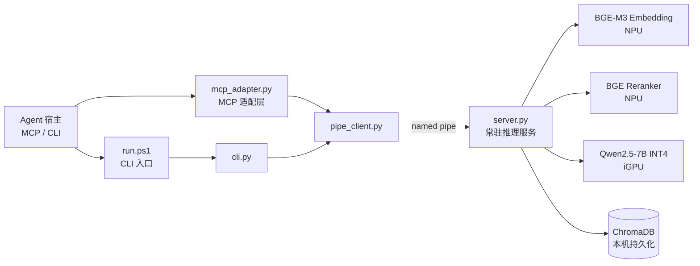

# local-kb-rag

**本地私有知识库 RAG Skill** —— 把 PDF / Markdown / TXT 笔记沉淀为「永不掉线、完全私有」的数字第二大脑。全链路 OpenVINO 本地推理：**NPU** 跑 Embedding 与 Rerank，**iGPU** 跑 LLM，无加速硬件时自动回退 **CPU**。语料、向量与模型全部驻留本机，只有答案文本回传 Agent 宿主。

面向 Windows AIPC（Intel Core Ultra 等）场景优化，同时可作为 MCP 工具或标准 CLI 使用。

[](LICENSE)
[](pyproject.toml)
[](README.md#运行要求)
[](docs/architecture.md)
[](skills/local-kb-rag/scripts/mcp_adapter.py)

<!-- CI 徽章：上传到 GitHub 后取消下方注释并替换 <OWNER>/<REPO>。
     也可改用 shields.io 动态徽章，无需写死仓库地址：
     [](../../actions/workflows/ci.yml)
-->
<!--
[](https://github.com/<OWNER>/<REPO>/actions/workflows/ci.yml)
-->

---

## ⚠️ 克隆本仓库后请先阅读

本仓库可**开箱即用**，但有 4 件事会影响你的体验，建议先花 1 分钟确认：

| 你要注意的 | 说明 | 处理 |
|---|---|---|
| **① Python 版本必须 3.10 – 3.12** | 依赖固定在预编译轮子覆盖范围内。**3.13+ 会回退到源码编译，极易失败** | 用 `python --version` 确认；不符请装 3.12 |
| **② 首次运行要下载数 GB 模型** | 从 ModelScope 拉取 BGE-M3 + Reranker + Qwen2.5-7B INT4，耗时取决于网络，支持断点续传 | 预留磁盘 ≥ 10 GB，首次调用请耐心等待 |
| **③ 仓库地址是占位符** | 本仓库不绑定任何远端地址，`config.yml` 的 `<OWNER>/<REPO>`、顶部 CI 徽章、`git clone` 示例、`pyproject.toml` 的 `[project.urls]` 均为占位或注释 | 见下方「维护者清单」；**不填不影响核心功能** |
| **④ 仅支持 Windows** | 依赖 named pipe（`\\.\pipe\local-kb-rag`）与 PowerShell 脚本，Linux/macOS 无法直接运行 | 见「运行要求」 |

最短上手路径：装 Python 3.12 → 跑 `scripts\install-env.ps1` → `run.ps1 status` 看到 `"state": "running"` 即成功。

**完整注意事项见 [`NOTICE.md`](NOTICE.md)** —— 含环境要求、克隆后必做两步、地址占位说明、修改源码的硬约束与隐私边界。

---

## 目录

- [克隆后请先阅读](#️-克隆本仓库后请先阅读)
- [项目简介](#项目简介)
- [功能特性](#功能特性)
- [工作原理](#工作原理)
- [目录结构](#目录结构)
- [运行要求](#运行要求)
- [安装步骤](#安装步骤)
- [使用说明](#使用说明)
- [配置说明](#配置说明)
- [测试](#测试)
- [故障排查](#故障排查)
- [路线图](#路线图)
- [贡献指南](#贡献指南)
- [许可证](#许可证)
- [致谢](#致谢)

> 完整的上手注意事项单列在 **[NOTICE.md](NOTICE.md)**。

---

## 项目简介

大多数「个人知识库」方案要求把文档上传到云端，或者至少把检索请求发出去。local-kb-rag 反其道而行：**整条链路都在你自己的机器上**。

- 文档解析、切分、向量化、检索、精排、生成，全部本地完成
- 语料原文、向量库、模型权重都落在 `%USERPROFILE%\.openvino\` 下，不出本机
- 首次通过 ModelScope 下载模型后，可**完全离线**运行
- 答案附带**真实检索片段**作为引用（`[1][2]` 与 `citations[]` 一一对应），可直接核对出处

它是为 AIPC 写的：Embedding 与 Reranker 这类高频小模型跑在 NPU 上，省电且不占显存；OpenVINO 会在设备不可用时自动回退，因此没有 NPU 的机器同样能用。

| 适用场景 | 说明 |
|---|---|
| 个人 PDF / 笔记库问答 | 把散落的文档变成一个可提问的知识库 |
| 研报摘要与带引用检索 | 只要原文片段和出处，避免「模型记忆」污染 |
| 离线私有第二大脑 | 无网络、无云依赖，数据完全自持 |

**不适用**：需要多租户隔离、跨机共享知识库、或必须使用非本地推理后端的场景。

## 功能特性

- **摄入** `kb_ingest` —— PDF / Markdown / TXT 或原始文本 → 切分 → 向量化 → ChromaDB 持久化；同一 `doc_id` 幂等覆盖
- **检索** `kb_search` —— 语义召回 + BGE Reranker 精排，热态往返约 < 2s；**只返回原文片段与页码，不生成**
- **问答** `kb_ask` —— 检索 → 精排 → 本地 LLM 生成，`citations[]` 与答案中 `[1][2]` 编号一一对应
- **管理** `kb_list_sources` / `kb_status` —— 文档清单与块数、服务状态、各模型实际运行的设备
- **双入口** —— MCP 工具与标准 CLI（`run.ps1`）共用同一条 named pipe 与同一个常驻 server
- **生命周期自管理** —— 首次调用自动拉起 server；空闲 300s 释放显存；脚本升级自动重启；崩溃后自动重拉
- **异构调度** —— 按 `device_preference` 依次尝试 NPU / GPU / CPU，算子不被支持时由 OpenVINO 自动回退
- **脚本升级检测** —— 核心脚本 hash 变化即重启 server，避免新旧代码混跑

## 工作原理



设计要点：

- **混合架构**：`cli.py` 与 `mcp_adapter.py` 是两条薄入口，共用 `pipe_client.py` 这一传输层，经 named pipe 调同一个常驻 `server.py`。模型只加载一次，两个入口共享同一个进程与显存。
- **一次一连接**：每次请求新建 pipe 连接、取回结果后关闭，避免长连接的半开状态与状态泄漏。
- **server 生命周期**：`downloading → loading → running → idle → shutdown` 状态机；`pipe 可连通` 是唯一的存活判据（不用 pidfile，规避 PID 复用误判）。
- **失败可见**：server 的 stdout / stderr 落盘到 `logs\local-kb-rag\server.stderr.log`，便于原生层崩溃后取证。

完整设计说明见 [`docs/architecture.md`](docs/architecture.md)。

## 目录结构

```text
local-kb-rag/                          # GitHub 仓库根
├── README.md                          # 项目说明（本文件）
├── NOTICE.md                          # ⚠ 克隆后先读：环境要求、地址占位、硬约束
├── LICENSE                            # Apache-2.0 全文
├── CHANGELOG.md                       # 变更记录
├── CONTRIBUTING.md                    # 贡献指南
├── CODE_OF_CONDUCT.md                 # 贡献者行为准则
├── SECURITY.md                        # 安全策略与威胁模型
├── pyproject.toml                     # 项目元数据清单（名称/描述/关键词/版本/许可证）
├── .gitignore
├── .github/
│   ├── PULL_REQUEST_TEMPLATE.md
│   ├── ISSUE_TEMPLATE/                # bug_report / feature_request / config
│   ├── scripts/
│   │   └── check_metadata.py          # 元数据与结构约定校验（CI 使用）
│   └── workflows/
│       └── ci.yml                     # 元数据校验 + 切分冒烟
├── docs/
│   └── architecture.md                # 架构、协议与生命周期
└── skills/
    └── local-kb-rag/                  # 可安装的 Skill 包（自包含，无 README）
        ├── SKILL.md                   # Agent 触发说明与工具映射
        ├── meta.json                  # Skill 展示元数据
        ├── info.json                  # 运行时配置（venv / 模型 / RAG 参数）
        ├── requirements.txt           # 运行依赖清单
        ├── assets/
        │   └── sample-note.md         # 示例语料
        ├── scripts/
        │   ├── run.ps1                # CLI 固定入口（硬件检测 → 确保环境 → cli.py）
        │   ├── install-env.ps1        # venv 创建 + 依赖安装（幂等）
        │   ├── cli.py                 # 标准 CLI 客户端
        │   ├── pipe_client.py         # named pipe 传输层（CLI 与 MCP 共用）
        │   ├── mcp_adapter.py         # MCP 适配层（stdio），暴露 5 个工具
        │   ├── server.py              # 常驻推理服务
        │   ├── rag_pipeline.py        # 解析 / 切分 / 检索 / 精排 / 生成
        │   ├── model_download.py      # 模型下载与导出
        │   └── common.py              # 路径约定、退出码、日志、设备探测
        └── tests/
            ├── test_split_smoke.py    # 切分冒烟（轻量，CI 使用）
            └── test-e2e.ps1           # 端到端测试（需 AIPC + 模型）
```

**为什么 Skill 包不放在仓库根？** Skill 包规范要求目录内不得存放 `README.md`（会与 `SKILL.md` 的元数据职责重叠），而 GitHub 要求仓库根有 `README.md`。monorepo 布局让两者同时成立：`skills/local-kb-rag/` 保持为一个可整体拷贝的 Skill 包，仓库根只承载项目文档。

## 运行要求

| 项目 | 要求 |
|---|---|
| 系统 | Windows 10 / 11（AIPC 推荐，纯 CPU 可兜底） |
| CPU | Intel Core Ultra 等带 NPU 的平台体验最佳；其他 x86-64 亦可 |
| 加速硬件 | NPU / iGPU 可选。无加速硬件时全部回退 CPU，功能不变、速度下降 |
| Python | 3.10 – 3.12（依赖预编译轮子的覆盖范围；3.13+ 易触发源码编译失败） |
| 内存 | ≥ 8 GB |
| 磁盘 | ≥ 10 GB（模型缓存） |
| 网络 | 首次需联网从 ModelScope 下载模型（数 GB，支持断点续传）；之后可离线 |

运行时数据**不落在仓库内**，统一位于用户目录：

```text
%USERPROFILE%\.openvino\
├── venvs\local-kb-rag\      # 独立虚拟环境
├── models\local-kb-rag\     # OpenVINO IR 模型缓存
├── data\local-kb-rag\       # ChromaDB 向量库与语料清单
├── logs\local-kb-rag\       # server.log / server.stderr.log
└── runtime\local-kb-rag\    # server.pid / server.hash
```

默认模型：`BAAI/bge-m3`（Embedding）、`BAAI/bge-reranker-v2-m3`（Rerank）、`OpenVINO/Qwen2.5-7B-Instruct-int4-ov`（生成，失败时回退 3B 版本）。

## 安装步骤

### 1. 获取代码

从你的仓库地址克隆（`<REPO_URL>` 指你实际托管的地址，如 `https://github.com/<你的账号>/local-kb-rag`）：

```bash
git clone <REPO_URL>.git
cd local-kb-rag
```

也可以直接下载仓库压缩包解压，效果相同。

### 2. 安装 Skill 到宿主

把 `skills/local-kb-rag/` 整个目录放到 Agent 宿主的 Skill 目录，或在宿主中指向该路径。例如 WorkBuddy 的用户级 Skill 目录为 `%USERPROFILE%\.workbuddy\skills\`，Qoder / TRAE Work 同理，按各自文档操作即可。

该目录是自包含的，可以单独拷贝分发，不依赖仓库根的任何文件。

### 3. 安装 Python 环境

```powershell
cd skills\local-kb-rag
powershell -ExecutionPolicy Bypass -File scripts\install-env.ps1

# 国内网络可加 -Mirror 使用清华 PyPI 镜像
powershell -ExecutionPolicy Bypass -File scripts\install-env.ps1 -Mirror
```

脚本是幂等的：重复执行会跳过已完成步骤；`requirements.txt` 未变化时跳过重装。

### 4. 注册 MCP（推荐）

在宿主的 MCP 配置（`mcp.json`）中加入：

```json
{
  "mcpServers": {
    "local-kb-rag": {
      "command": "%USERPROFILE%\\.openvino\\venvs\\local-kb-rag\\Scripts\\python.exe",
      "args": ["<绝对路径>\\skills\\local-kb-rag\\scripts\\mcp_adapter.py"]
    }
  }
}
```

`args` 指向 `mcp_adapter.py` 的**绝对路径**；`command` 使用第 3 步创建的 venv 解释器。

### 5. 验证安装

```powershell
cd skills\local-kb-rag
.\scripts\run.ps1 status
```

首次运行会拉起常驻 server 并触发模型下载（数 GB，耗时取决于网络），`kb_status` 会依次报出 `downloading → loading → running`。看到 `"state": "running"` 即安装成功。

## 使用说明

### MCP 工具

供 Agent 直接调用，无需手动敲命令：

| 工具 | 作用 | 典型请求 |
|---|---|---|
| `kb_ingest` | 摄入文件路径或原始文本 | 「把这份 PDF 加进知识库」 |
| `kb_search` | 语义检索片段（不生成，快） | 「在我笔记里找关于 NPU 的片段」 |
| `kb_ask` | 带引用问答 | 「根据我的文档回答：如何部署到 NPU？」 |
| `kb_list_sources` | 列出已纳管文档 | 「知识库里都有什么」 |
| `kb_status` | 服务状态与设备信息 | 「RAG 服务跑在什么设备上」 |

Agent 侧的使用指引（何时选 `kb_search` 而非 `kb_ask`、如何处理首次冷启动等）写在 [`skills/local-kb-rag/SKILL.md`](skills/local-kb-rag/SKILL.md)。

### CLI

```powershell
cd skills\local-kb-rag

.\scripts\run.ps1 status                                  # 服务状态
.\scripts\run.ps1 ingest --source "C:\notes\spec.pdf" --doc-id spec
.\scripts\run.ps1 search --query "OpenVINO 如何部署到 NPU" --top-k 3
.\scripts\run.ps1 ask --query "本方案如何保证隐私不出机？"
.\scripts\run.ps1 list-sources
.\scripts\run.ps1 remove-source --doc-id spec
.\scripts\run.ps1 shutdown                                # 手动释放显存
```

用仓库自带的示例语料快速验证整条链路：

```powershell
.\scripts\run.ps1 ingest --source ".\assets\sample-note.md" --doc-id sample-note
.\scripts\run.ps1 ask --query "本地 RAG 如何保证隐私不出机？"
```

CLI 输出统一为 UTF-8 JSON（`ensure_ascii=False`），可直接管道给 `jq` 或宿主程序解析。

### 首次调用行为

| 阶段 | 表现 |
|---|---|
| server 不存在 | 自动后台拉起，无需手动启动 |
| 模型未下载 | 进入 `downloading`，支持断点续传；`kb_ingest` 预算 1800s，首次调用请耐心等待 |
| 模型加载中 | 进入 `loading`，冷启动预算 90s（要求 < 60s 达标） |
| 空闲 300s | 自动 shutdown 释放显存；下次调用重新拉起（模型已在磁盘，启动更快） |
| 脚本被更新 | 检测到核心脚本 hash 变化，自动重启 server 采用新代码 |

### 退出码

CLI 以退出码区分失败类型，便于脚本化处理：

| 码 | 含义 |
|---|---|
| 0 | 成功 |
| 2 | 非 AIPC / 硬件不满足（无可用 OpenVINO device 或内存不足） |
| 3 | 环境或依赖错误 |
| 4 | 模型下载失败 |
| 5 | server 不可用 |
| 6 | 请求参数错误 |

## 配置说明

| 文件 | 作用 | 何时改 |
|---|---|---|
| `skills/local-kb-rag/info.json` | 运行时配置：venv 名称、内存门槛、空闲超时、pipe 名、模型清单与设备偏好、RAG 参数（chunk_size / overlap / top_k 等） | 换模型、调切分粒度、改设备优先级 |
| `skills/local-kb-rag/requirements.txt` | 运行依赖清单（版本区间已钉住） | 升级 OpenVINO / ChromaDB 等依赖 |
| `skills/local-kb-rag/meta.json` | Skill 展示元数据（名称、版本、描述、标签、许可证） | 发版时同步 `version` |
| `pyproject.toml` | 项目级元数据（名称、描述、关键词、版本、许可证、Python 版本约束） | 发版时同步 `version` |

> `pyproject.toml` 只声明项目元数据，本项目**不作为 Python 包分发**，不提供 `pip install local-kb-rag`。Skill 的运行依赖由 `install-env.ps1` 安装到独立 venv。
>
> `version` / `license` / `name` 在三处（`pyproject.toml`、`meta.json`、`SKILL.md`）必须一致，由 `check_metadata.py` 与 CI 强制校验。

## 测试

| 层级 | 命令 | 依赖 | 耗时 |
|---|---|---|---|
| 切分冒烟 | `python skills\local-kb-rag\tests\test_split_smoke.py` | 无（stub 掉 numpy） | 秒级 |
| 元数据校验 | `python .github\scripts\check_metadata.py` | 无（标准库） | 秒级 |
| 端到端 | `powershell -ExecutionPolicy Bypass -File skills\local-kb-rag\tests\test-e2e.ps1` | Windows AIPC + 已下载模型 | 数分钟起 |

端到端脚本覆盖：环境安装幂等 → 模型就绪校验 → 冷启动 < 60s → ingest / search / ask 带引用 → 中文编码往返 → 退出码规范 → 优雅关停。它需要真实硬件与数 GB 模型，因此**不纳入 CI**，仅本地运行。

CI（[`.github/workflows/ci.yml`](.github/workflows/ci.yml)）只跑前两层，给出无硬件依赖的红绿信号。

## 故障排查

| 现象 | 原因与处理 |
|---|---|
| `no OpenVINO device available`（退出码 2） | 未装 OpenVINO 或驱动异常。先跑 `install-env.ps1`；仍失败则检查 iGPU / NPU 驱动是否为最新 |
| `insufficient memory: xGB < 8GB required` | 物理内存低于 `info.json` 的 `mem_need_gb`；可在 info.json 中调低，但推理可能 OOM |
| 卡在 `downloading` 很久 | 模型数 GB，属正常。日志在 `logs\local-kb-rag\`；断点续传，中断后重跑即可 |
| `server not running within budget` | 冷启动超 90s。查看 `server.stderr.log`——常见原因是首次加载时仍在下载或磁盘偏慢 |
| `pipe not reachable`（退出码 5） | server 已死且未重拉。`.\scripts\run.ps1 shutdown` 后再 `status` 强制重建 |
| 中文输出乱码 | CLI 已强制 UTF-8。若在旧版控制台里仍乱码，先 `chcp 65001` |
| PDF 摄入返回 0 块 | 扫描件无文本层，本 Skill 不含 OCR。请先用其他工具转出文本，或用 `--content` 直接传文本 |
| 导入到错误的包版本 | `common.py` 会自动剥离外部 `PYTHONPATH`。若你自行改过 `sys.path`，请移除干扰 |

更多日志与诊断入口见 [`docs/architecture.md`](docs/architecture.md)。

## 路线图

- [ ] 支持更多文档格式（DOCX、EPUB、HTML）
- [ ] 可选的增量索引与后台重建
- [ ] 多知识库分区（按 collection 隔离）
- [ ] 检索质量评测脚本（召回率 / 引用命中率）
- [ ] 在 CI 中补充依赖可安装性检查（当前仅元数据与冒烟）

欢迎通过 Issue 讨论优先级。

<details>
<summary><b>维护者：上传到 GitHub 后的检查清单</b></summary>

本仓库**不预设、也不绑定**任何具体远端地址（当前未初始化 `.git`）—— 托管到哪个账号、叫什么名字，由你上传时决定。因此下列位置留了占位/注释，上传后按需回填。

### 1. 需要回填仓库地址的位置（4 处，均可选）

| 位置 | 现状 | 处理方式 |
|---|---|---|
| `.github/ISSUE_TEMPLATE/config.yml` | 3 处含 `<OWNER>/<REPO>` | 把 3 处 `<OWNER>/<REPO>` 整体替换为 `用户名/仓库名`；**或直接删掉整个 `contact_links` 段**（Issue 模板照常可用） |
| 本文件顶部 CI 徽章 | 注释块，含 `<OWNER>/<REPO>` | 取消注释并替换；**或改用 shields.io 动态徽章**（见文件内注释，无需写死地址） |
| 本文件「获取代码」的 `git clone` | `<REPO_URL>` 占位 | 替换为实际克隆地址 |
| `pyproject.toml` 的 `[project.urls]` | 整体注释 | **无需处理**（见下方说明） |

**都不填也能正常工作**：`config.yml` 的入口会指向无效地址（可删除规避），CI 徽章不显示，`git clone` 只是个示例，缺失 `[project.urls]` 无影响。核心功能完全不受影响。

> **为什么 `config.yml` 不能自动化？** GitHub 的 `contact_links.url` 只接受**绝对 URL**（`http(s)://` 开头），既不支持相对路径也不支持 `${{ }}` 表达式 —— 这是该文件的硬限制，无法像 CI 工作流那样用 `${{ github.repository }}` 动态取址。
>
> **`pyproject.toml` 的 `[project.urls]` 无需回填**：默认整体注释。本项目不作为 Python 包分发（无 `pip install`），缺失该字段不影响功能，也不会被 CI 判为错误。需要时再取消注释。

### 2. 为什么 CI 工作流不需要回填

`.github/workflows/ci.yml` 引用的是 `${{ github.* }}` 上下文变量（如 `github.ref`）与 `actions/checkout` 等动作，**不含任何绝对地址**，因此换账号、改仓库名都无需改动。

### 3. 上传后开启的功能

- **私有漏洞报告** —— 仓库 Settings → Security → Private vulnerability reporting。`SECURITY.md` 与 Issue 模板中的私下上报渠道依赖此开关，**未开启时相关链接会 404**
- **仓库信息** —— Description 与 Topics 可直接取用 `pyproject.toml` 的 `description` 与 `keywords`
- **分支保护**（可选）—— 建议要求 PR 通过 `CI` 工作流的 `metadata` 与 `smoke` 两个作业

### 4. 打标签发版

```bash
git tag v1.0.0 && git push origin v1.0.0
```

Release 说明可从 `CHANGELOG.md` 对应小节复制。如需版本 diff 链接，可在 `CHANGELOG.md` 顶部按 `<REPO_URL>/compare/vX..vY` 格式补充。

### 5. 推送前本地自检

```powershell
python skills\local-kb-rag\tests\test_split_smoke.py
python .github\scripts\check_metadata.py
```

</details>

## 贡献指南

欢迎提交 Issue 与 Pull Request。开始前请阅读：

- [`CONTRIBUTING.md`](CONTRIBUTING.md) —— 目录与命名约定、结构硬约束、本地检查命令、提交信息与 PR 期望
- [`CODE_OF_CONDUCT.md`](CODE_OF_CONDUCT.md) —— 参与本项目需遵守的行为准则
- [`SECURITY.md`](SECURITY.md) —— 安全问题请走私下的漏洞报告渠道，**不要开公开 Issue**

最低要求：改动需通过切分冒烟与元数据校验；涉及运行时行为时，补充可验证的测试说明。

## 许可证

本项目采用 [Apache License 2.0](LICENSE) 授权，版权归 local-kb-rag contributors 所有。

第三方模型与依赖各自遵循其上游许可证，下载与使用前请自行确认：

| 组件 | 上游许可证 |
|---|---|
| OpenVINO™ / Optimum-intel | Apache-2.0 |
| BAAI/bge-m3、BAAI/bge-reranker-v2-m3 | MIT |
| Qwen2.5-7B-Instruct | Apache-2.0 |
| ChromaDB | Apache-2.0 |
| PyMuPDF | AGPL-3.0 / 商业双许可（请留意其条款） |

> 上表为便于核对而整理，**不构成法律意见**；以各上游仓库的 LICENSE 为准。

## 致谢

- [OpenVINO™](https://github.com/openvinotoolkit/openvino) —— 让 NPU / iGPU 推理在消费级 AIPC 上可用
- [BAAI](https://github.com/FlagOpen/FlagEmbedding) —— BGE-M3 与 BGE Reranker
- [Qwen](https://github.com/QwenLM/Qwen2.5) —— Qwen2.5 指令模型
- [Chroma](https://github.com/chroma-core/chroma) —— 嵌入式向量库
- [ModelScope](https://modelscope.cn/) —— 国内网络友好的模型分发
