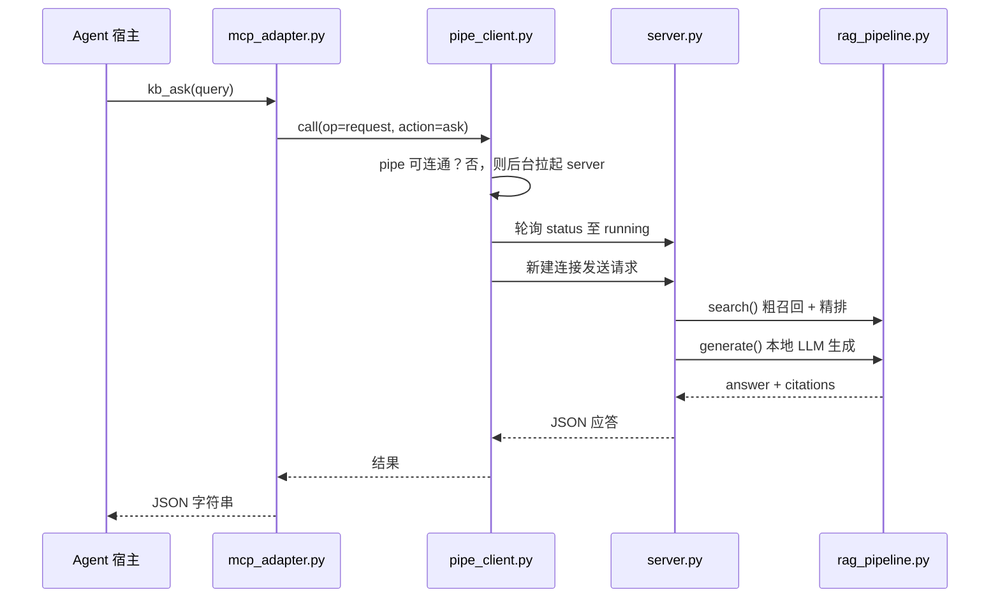

# 架构说明

本文说明 local-kb-rag 的分层结构、通信协议、生命周期与数据模型，供二次开发与问题定位使用。

## 设计目标与约束

| 目标 | 落地方式 | 代价 |
|---|---|---|
| 语料不出机 | 解析、向量化、检索、生成全部本地完成；向量库用磁盘持久化的 ChromaDB | 依赖本机算力 |
| 模型只加载一次 | 常驻 server 持有全部模型，入口进程短命 | 需要进程间通信 |
| 冷启动可接受 | 模型常驻 + 空闲超时才回收；脚本升级才重启 | 空闲期占用内存/显存 |
| 无加速硬件也能用 | 按 `device_preference` 逐级尝试，加载失败或算子不支持则回退 CPU | 速度下降 |
| 引用可核对 | 引用文本由检索结果强制回填，不经过 LLM | 答案与引用需用户自行比对 |

明确约束：**单机单用户**。named pipe 的 authkey 是防误连的常量，不构成对抗同机恶意进程的访问控制，详见 [SECURITY.md](../SECURITY.md)。

## 分层架构

系统分三层，依赖方向单向向下：

| 层 | 组件 | 职责 | 不该做的事 |
|---|---|---|---|
| 入口层 | `run.ps1` + `cli.py`<br/>`mcp_adapter.py` | 参数解析 / 协议翻译 / 结果序列化 | 不做推理，不直接读写向量库 |
| 传输层 | `pipe_client.py` | 连接管理、拉起 server、升级重启、健康检查、重试 | 不理解业务语义 |
| 内核层 | `server.py` → `rag_pipeline.py` | 状态机、请求分发、模型常驻、RAG 流水线 | 不感知调用方是 CLI 还是 MCP |

两个入口共享同一条 named pipe 与同一个 server 进程，因此：

- 模型只加载一次，CLI 与 MCP 共享同一份显存占用
- 两条入口的行为必然一致（退出码、错误语义由同一内核返回）

### 一次 `kb_ask` 的调用路径



## named pipe 协议

实现基于 `multiprocessing.connection`，**一请求一连接**（`send` → `recv` → `close`），不做长连接复用。

| 项 | 值 | 定义位置 |
|---|---|---|
| 地址 | `\\.\pipe\local-kb-rag` | `common.PIPE_ADDRESS` |
| authkey | `b"local-kb-rag"` | `common.AUTH_KEY` |
| 编码 | 消息体为 Python dict，JSON 序列化后回传调用方 | `cli.py` / `mcp_adapter.py` |

### 请求

```jsonc
{ "op": "status" }                                    // 查询状态
{ "op": "shutdown", "timeout": 10.0 }                 // 优雅关停
{ "op": "request", "action": "ingest", ... }          // 业务动作
```

`action` 取值：`ingest` | `search` | `ask` | `list_sources` | `remove_source`。

### 应答

```jsonc
// status（running 态附带 stats）
{ "ok": true, "state": "running", "pid": 1234, "uptime_s": 42.0,
  "script_hash": "…", "docs": 3, "chunks": 128, "devices": {"embedding": "NPU", ...} }

// status（downloading 态附带进度）
{ "ok": true, "state": "downloading", "progress": "bge-m3: exporting" }

// 业务成功
{ "ok": true, "…": "…" }

// 参数错误：bad_request 标志 → 调用方映射为退出码 6
{ "ok": false, "error": "…", "bad_request": true }

// server 未就绪
{ "ok": false, "error": "server not ready (state=loading)", "state": "loading" }
```

调用方据 `ok` / `bad_request` 决定抛 `BadRequest`（退出码 6）还是 `ServerUnavailable`（退出码 5）。

## server 生命周期

### 状态机

```text
starting ──► downloading ──► loading ──► running ──► shutting_down ──► 退出
    │             │              │          │
    └─────────────┴──────────────┴──────────┴──► error（保留 traceback 供 status 查询）
```

模型加载在后台线程执行，主循环**任意状态下都能应答 `status`**，因此调用方可以轮询到下载进度与错误堆栈，而不是干等超时。

### 关键机制

| 机制 | 实现 | 解决的问题 |
|---|---|---|
| 单实例保护 | 启动前探测 pipe 是否可连通，可连通则退出 | 避免多个 server 争抢模型与显存 |
| 存活判据 | **只用 pipe 可连通性**，不用 pidfile + PID 检测 | Windows PID 复用会误判「已有实例」导致永久拒启；server 硬崩后 pidfile 残留同样会误判 |
| 脚本升级重启 | 启动时写 `server.hash`；客户端比对核心脚本联合 hash，不一致则关停重启 | 避免新旧代码混跑 |
| 空闲回收 | 看门狗每 5s 检查，`running` 态且空闲超过 `server_alive_timeout` 秒则自动关停（自连一次 pipe 解除 `accept` 阻塞） | 空闲时释放显存；`-1` 表示永不回收 |
| 崩溃取证 | server 的 stdout / stderr 落盘到 `server.stderr.log` | 原生层崩溃时不丢线索 |
| 请求串行化 | `req_lock` 保护 RAG 动作 | 模型非线程安全 |
| 环境净化 | `common.sanitize_pythonpath()` 在模块加载时剥离外部 `PYTHONPATH` 条目 | 机器级共享包目录里的异构依赖（如旧版 numpy）遮蔽 venv 包导致运行时崩溃 |

核心脚本联合 hash 覆盖 `server.py`、`rag_pipeline.py`、`model_download.py`、`common.py`（`common.CORE_SCRIPTS`）。

### 冷启动预算

| 阶段 | 预算 | 说明 |
|---|---|---|
| 启动至 `running`（模型已下载） | 90s 超时，要求 < 60s 达标 | `pipe_client.STARTUP_TIMEOUT_S` |
| 首次模型下载 | 3600s | `pipe_client.DOWNLOAD_TIMEOUT_S`，`downloading` 态使用更长预算 |
| `ingest` 单次调用 | 1800s | MCP 工具超时 |

## 数据模型

ChromaDB 持久化于 `%USERPROFILE%\.openvino\data\local-kb-rag\chroma`，集合名 `local_kb`，距离度量 `cosine`（HNSW）。

| 字段 | 含义 |
|---|---|
| `id` | `"{doc_id}:{seq}"`，`seq` 为文档内全局块序号 |
| `document` | 块原文（切分结果） |
| `embedding` | BGE-M3 CLS 池化 + L2 归一化后的向量 |
| `metadata.doc_id` | 文档标识。文件按 `sha1(绝对路径)[:12]`，原始文本按 `sha1(内容)[:12]`，也可由调用方指定 |
| `metadata.doc` | 文档名（文件名或 `inline`） |
| `metadata.chunk_id` | 文档内块序号，从 0 开始 |
| `metadata.page` | 页码，PDF 从 1 起；Markdown / TXT 恒为 1 |
| `metadata.offset` | 块首在页文本中的字符偏移，用于原文定位 |
| `metadata.ingested_at` | 摄入时间（ISO 8601，秒精度） |

**幂等语义**：同一 `doc_id` 再次摄入会先删除旧块再写入新块，因此重复摄入同一文件不会产生重复内容，而是覆盖更新。

### 切分规则

`split_text()` 采用「先按边界聚合、再对超长块硬切」的两级策略：

1. 按空行切分段落，记录每段在原文中的偏移
2. 依次聚合段落，累计长度（含分隔符）不超过 `chunk_size` 则并入当前块，否则另起一块
3. 仍超过 `chunk_size` 的块按 `step = chunk_size - overlap` 硬切，保留重叠以维持上下文连续性

`offset` 始终指向块首段在原文中的起点，因此空行归一化不会破坏定位准确性（`tests/test_split_smoke.py` 对此有断言）。

### 解析器插槽

`PARSERS` 是扩展后缀名到解析函数的注册表，当前支持 `.pdf` / `.md` / `.markdown` / `.txt`。解析器统一返回 `[{"text": ..., "page": ...}]`，新增格式只需注册一个函数，无需改动下游。

## 检索与生成链路

### search

1. 粗召回：`n = top_k × rerank_candidates_factor`（默认 `5 × 4 = 20`），上限为集合总块数；可用 `filter.doc_id` 限定单文档
2. 距离转相似度：`score = 1 - cosine_distance`
3. 精排：用 BGE Reranker 对候选块逐条打分，**覆盖** `score` 并按降序重排
4. 截断至 `top_k`

`rerank=False` 时跳过第 3 步，用于**性能对比与降级验证**，不作为常规路径。

### ask

1. 复用 `search`（始终开启精排）拿到 Top-K 片段
2. 拼装上下文，每段前置 `[i] （来源：文档名 第N页）`
3. 送入本地 LLM 生成，`do_sample=False` 保证问答确定性、抑制幻觉；提示词明确要求「仅依据上下文回答，不足则声明未找到」
4. **引用强制回填**：`citations[]` 的文本直接取自检索到的真实块（截断至 300 字符），**不经过 LLM**。因此引用是可核对的原文，即使答案措辞有偏差，也能对照出处判断

检索为空时直接返回「知识库中未找到相关内容」并给出空 `citations`，不调用 LLM。

## 设备调度与降级

按 `info.json` 中每个模型的 `device_preference` 顺序选择设备，两个层级都会回退：

1. **选择阶段**（`common.pick_device`）：遍历偏好列表，匹配可用设备（支持 `GPU.0` 这类带序号的设备名），全不匹配则用 `CPU`
2. **加载阶段**（`RagPipeline._load_with_fallback`）：非 CPU 设备加载抛异常时，记 warning 并用 CPU 重新加载

此外，**算子级回退**由 OpenVINO 自身完成：即使 `device="NPU"` 编译成功，遇到 NPU 不支持的算子也会自动交给 CPU 执行。

NPU 只接受静态 shape，因此 Embedding 与 Reranker 在 `device` 以 `NPU` 开头时会 `reshape(1, max_length)` 固定输入尺寸。

`kb_status` 返回的 `devices` 是**实际生效**的设备，与偏好配置可能不同（发生过回退），排查性能问题时应以此为准。

## 退出码

| 码 | 含义 | 触发点 |
|---|---|---|
| 0 | 成功 | — |
| 2 | 非 AIPC / 硬件不满足 | `cli.py` 预检无可用 device；`run.ps1` 内存不足 |
| 3 | 环境或依赖错误 | `install-env.ps1` 失败；`mcp_adapter.py` 缺少 `mcp` 包 |
| 4 | 模型下载失败 | `model_download.py` |
| 5 | server 不可用 | pipe 不可达或 server 进入 `error` |
| 6 | 请求参数错误 | 内核抛 `ValueError`，应答带 `bad_request` |

## 运行时数据布局

```text
%USERPROFILE%\.openvino\
├── venvs\local-kb-rag\      # 独立虚拟环境（install-env.ps1 创建）
├── models\local-kb-rag\     # OpenVINO IR：bge-m3 / bge-reranker-v2-m3 / qwen2.5-…
├── data\local-kb-rag\
│   └── chroma\              # ChromaDB 持久化目录
├── logs\local-kb-rag\
│   ├── server.log           # 结构化运行日志
│   └── server.stderr.log    # 进程 stdout/stderr，崩溃取证
└── runtime\local-kb-rag\
    ├── server.pid           # 仅作诊断参考，不作存活判据
    └── server.hash          # 核心脚本联合 hash，用于升级重启
```

仓库内不含任何运行时数据；`tests/*` 与 `assets/sample-note.md` 是唯一随仓库分发的测试资源。

## 已知限制

- **无 OCR / ASR**：扫描件 PDF 无文本层时解析结果为空，`ingest` 会报「document parsed to empty text」。解析器插槽已预留，但未实现。
- **单集合**：所有文档写入同一 collection，无法按知识库分区隔离。
- **CLI 无流式输出**：一次请求一次应答，`ask` 需等待完整生成结果。
- **粗召回为逐条编码**：Embedding 按 `batch = 16` 分批但逐条前向，NPU 静态 shape 下的吞吐有优化空间。
- **`rerank=False` 不降级为更快模型**：只是跳过精排，召回质量随之下降。
